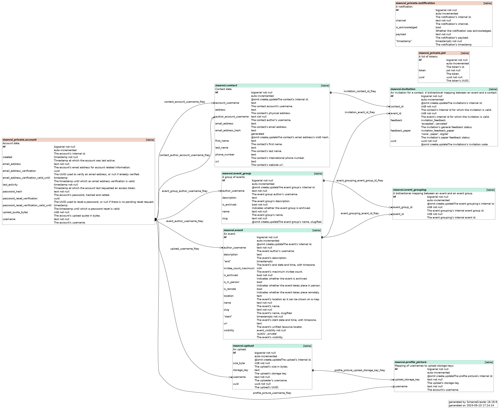

# Sqitch

[Sqitch](https://sqitch.org/) is maevsi's database migration tool.

## Database Diagram

This diagram shows the structure of maevsi's database.

You can create this file as follows:

1. configure [maevsi_stack](https://github.com/maevsi/maevsi_stack) by adding a portforward of `5432:5432` to the `postgres` service

1. start `maevsi_stack`

1. run `docker run -v /run/postgresql/:/run/postgresql/ --network=host --name schemacrawler --rm -i -t --user=0:0 --entrypoint=/bin/bash schemacrawler/schemacrawler`

1. connect as user `schcrwlr` to the now running `schemacrawler` container, e.g. using Portainer

1. as `schcrwlr` run `schemacrawler --server=postgresql --database=maevsi --user=postgres --password=postgres --command=schema --info-level=maximum --output-format=png --output-file=graph.png --schemas=maevsi.*`

1. as `root` install curl using `apk update && apk add curl`

1. still as `root` run `curl -i -F file="@graph.png" "https://tmpfiles.org/api/v1/upload"`

1. click the link in the output and download the image that pops up!
